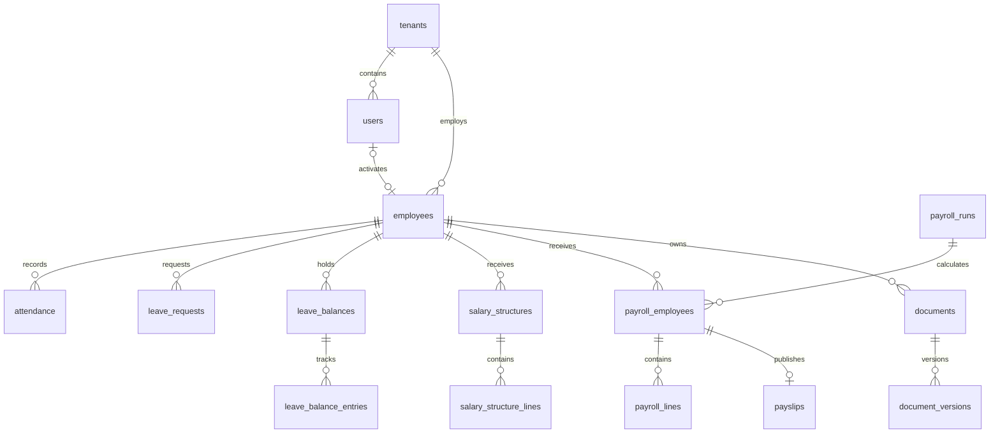

# Phase 1 database schema

Baseline: `Micro_HRMS_Phase_1_Requirements_v1.1.docx`. There are 40 application tables, plus TypeORM's `schema_migrations` table. Domain mappings are in `apps/api/src/modules/*/*.schemas.ts`; they describe persistence, not public API DTOs.

| Domain | Tables |
| --- | --- |
| Tenants and plan readiness | tenants, subscription_plans |
| Identity and permissions | users, roles, permissions, user_roles, role_permissions, auth_tokens, sessions |
| Organization | departments, designations, locations, work_schedules |
| Employees | employees, employee_private_data |
| Attendance | attendance, attendance_regularizations |
| Holidays | holidays |
| Leave | leave_types, leave_policies, employee_leave_policies, leave_balances, leave_requests, leave_balance_entries |
| Payroll | salary_components, salary_structures, salary_structure_lines, payroll_runs, payroll_employees, payroll_lines, payslips |
| Documents | document_categories, documents, document_versions |
| Notifications and export operations | notifications, outbox_events, export_jobs |
| Audit and platform operations | audit_logs, platform_admins, support_access_grants |

## Main relationships

Every tenant relationship also carries `tenant_id`. Foreign keys cannot point to another company's records even when a UUID is known. The global tables are `subscription_plans`, `permissions`, and `platform_admins`. All remaining tables are tenant-scoped, including the tenant's own row.

## Storage and invariants

- UUID primary keys use PostgreSQL `gen_random_uuid()`.
- UTC instants use `timestamptz`; business dates use `date`; attendance stores an explicit `work_date`.
- Money uses `numeric(18,2)` and is returned as a string. Keep monetary arithmetic decimal-safe in services; never use JavaScript floating-point calculations. Leave units also use exact numeric storage.
- Employee codes and emails are unique within a tenant. User email must already be lowercase. The same email may exist in multiple companies; login will need tenant resolution.
- One attendance row per employee/day and one pending correction per employee/day are enforced. Checkout must not precede check-in.
- Holidays are unique per company/date or location/date using partial indexes. If a company and location holiday coincide, calendar calculation must count the day once.
- Leave balances track credited, used, pending and adjusted units. Available balance is `credited + adjusted - used - pending`; it is computed, not stored. Negative availability is rejected. Uncontrolled unpaid leave need not create a balance reservation.
- Salary structures are effective-dated. Payroll input snapshots and component names/codes preserve historical meaning.
- Payroll runs are unique per exact date period. Decimal totals must reconcile arithmetically. Database triggers prevent changing locked runs or their employee/line records; publication metadata may change after locking.
- Audit logs and leave balance entries are append-only. Business-history tables have no runtime DELETE grant. Administrative retention is a separate maintenance procedure.
- Employee bank/identifier fields are ciphertext-only columns with a key version. Encryption/decryption and key management must be implemented before accepting real sensitive values.
- Files are represented by object keys, MIME types, byte sizes and checksums. Binary files belong in private object storage.
- Token/session fields hold hashes, never plaintext credentials. Single-use consumption and session revocation require transactional authentication services.
- Notifications and outbox records include idempotency keys. The outbox allows a business transaction to commit even if BullMQ/email delivery is temporarily unavailable; the dispatcher is a later implementation task.

## Decisions and service rules still required

The initial trial plan, INR, Asia/Kolkata, Monday-Friday schedule and 100-person limits are configurable starting defaults, not approved commercial rules. No tenant, employee or default password is seeded. Tenant roles and their permission assignments should be provisioned atomically during company registration; the migration seeds only global permission definitions and the trial plan.

Attendance calculations, holiday applicability, reporting hierarchy checks and leave entitlement enforcement are implemented in their dedicated services. Leave carry-forward is an explicit audited HR transfer. Monthly salary proration and optional approved unpaid-leave deductions are implemented in [payroll management](payroll-management.md); automated accrual and statutory payroll calculations remain pending. See [leave management](leave-management.md) for the January–December rules.

Migration `1791378000000-LeaveRequestCalculation` adds `leave_requests.calculation` (non-null JSONB, default `{}`). New requests snapshot charged dates/halves, policy flags, balance reference, timezone and calendar/schedule inputs. Existing requests are not silently recalculated.

Service transactions must prevent overlapping salary effective periods, overlapping balance periods, overlapping payroll periods with different boundary dates, and conflicting leave requests/half-days. Uniqueness constraints alone do not prevent these overlaps. Lock the relevant employee/balance/payroll records for concurrent transitions and add exclusion constraints in a future migration once the exact policy is agreed.

Locked payroll is immutable. An audited post-lock correction workflow requires additional service design. Payroll services now reconcile totals, publish only locked snapshots and enforce payslip ownership. Document-library visibility remains separate work.

Migration `1791385000000-PayrollVersions` adds integer `calculation_version` to
`payroll_runs` (default 0) and `payroll_employees` (default 1), both non-null. The
employee snapshot unique key is now `(tenant_id, payroll_run_id, employee_id,
calculation_version)`. Existing foreign keys remain unchanged. The migration also
grants the runtime role column-level `UPDATE(settings)` on `tenants`.

`updated_at` is managed by TypeORM on ORM updates. Raw SQL writers must set it explicitly. Audit metadata must be sanitized by the application before insertion.

## Migration sequence

1. `InitialPhaseOne1791178103170` creates 40 tables, indexes, constraints and tenant-aware relationships.
2. `TenantSecurity1791178103171` adds RLS policies, runtime grants, reference data and history/payroll protection triggers.
3. `NormalizeScheduleDefault1791178103172` normalizes the PostgreSQL array default so schema generation produces no spurious changes.

See [database setup](database-setup.md) for credentials, commands, test procedure and production deployment boundaries.
